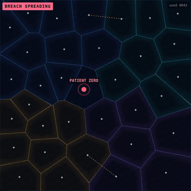
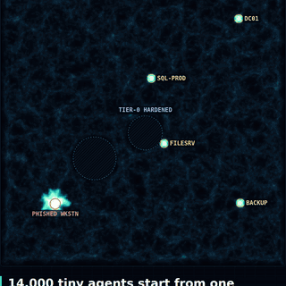
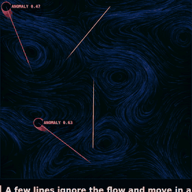
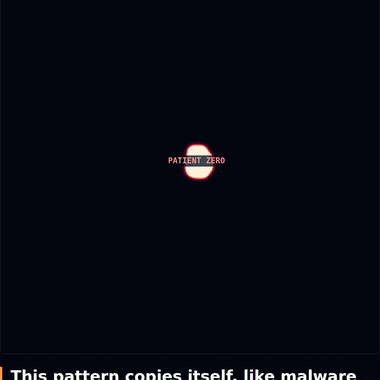
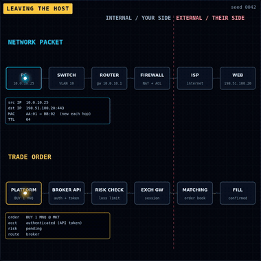

# Signal & Noise

**Security ideas you can watch happen.**

Generative art where the simulation *is* the lesson. Each piece runs a real algorithm (Voronoi, slime-mold agents, flow fields, reaction-diffusion, packet routing), and a security concept falls out of how it behaves. Every piece also comes with a translation for traders, because risk works the same way on a network and in an account.

▶ **Live gallery:** https://n1ghtsh1ft1.github.io/signal-and-noise/ (change the seed, move the sliders, export a PNG)

| | Piece | Security idea | Trader's translation |
|---|---|---|---|
|  | **01 · Holdings**<br>Voronoi + Lloyd relaxation + graph BFS | Segmentation & blast radius: a breach only crosses borders a rule allows | Position sizing: one bad trade can't empty the account |
|  | **02 · Slime Path**<br>Physarum agent simulation | Lateral movement: attackers find the shortest road to the crown jewels; hardened tiers force detours | Stop hunting: price finds stop clusters the same way |
|  | **03 · Baseline**<br>Curl-noise flow field + deviation scoring | Anomaly detection: learn normal, flag what refuses to follow it | Unusual volume only stands out if you know an average day |
|  | **04 · Containment**<br>Gray-Scott reaction-diffusion | Incident response: spread → contain → eradicate → recover | Daily loss limit: stop, contain, review, come back tomorrow |
|  | **05 · Packet Walk**<br>Hop-by-hop L2/L3 + NAT animation | How a packet leaves your network: MAC rewritten per hop, NAT at the edge, ACL can deny | An order gets auth + risk checks before the exchange sees it |

## What's in here

```
index.html          live, interactive gallery (no libraries, plain JS + canvas)
src/pieces.js       the five simulations, all seeded and reproducible
src/content.js      plain-language copy for each piece
render/             scripts that export LinkedIn cards (1080×1350) and vertical videos (1080×1920)
media/              exported cards, vertical videos, preview GIFs
posts/              LinkedIn captions and YouTube Shorts plan
CONCEPT.md          the idea behind the series
```

## Rebuild the media

```bash
pip install playwright        # uses Chromium
python3 render/render_cards.py      # -> media/*-card.png
python3 render/render_shorts.py     # -> media/*-short.mp4 (needs ffmpeg)
```

## Notes

- Same seed = same picture. Every run is reproducible.
- Example IP addresses come from the documentation ranges in RFC 5737, not real networks.
- The trading parallels are analogies for how risk spreads, not trading advice.

---

Isaiah C. Anderson · Security+ (SY0-701) · SOC analyst track · [github.com/N1ghtsh1ft1](https://github.com/N1ghtsh1ft1)
