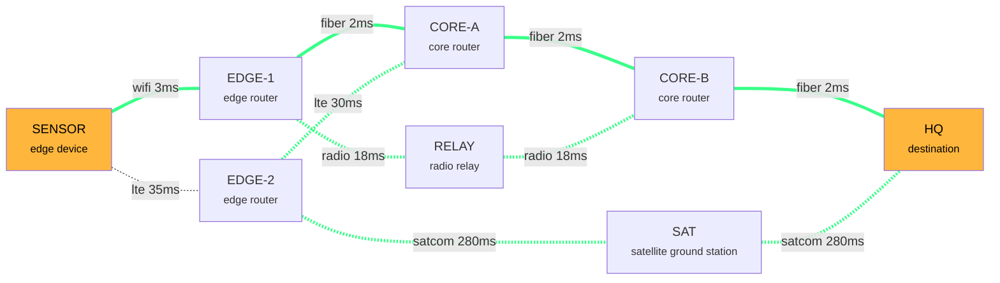

# Assume the backbone is compromised

A tiny lab tool inspired by DARPA's MINC idea: don't trust one network path. Treat every link you have (fiber, Wi-Fi, LTE, radio, satellite) as a tile, and rebuild a route on the fly when one gets cut or jammed.

`failover_sim.py` sends a numbered message from `SENSOR` to `HQ`, breaks links mid-stream, re-routes around the damage, then proves the message arrived intact with sequence numbers and a SHA-256 check.

Pure Python 3, no installs. It's a teaching simulator. It doesn't touch real interfaces or send real traffic.

## Run it

```bash
python3 failover_sim.py topology.json
python3 failover_sim.py topology.json --message "your text here" --seed 7
python3 failover_sim.py topology.json --mermaid map.mmd     # export a diagram
```

## What you'll see

```
  edge-mosaic-lab  |  SENSOR -> HQ  |  17 packets

  -> route: SENSOR > EDGE-1 > CORE-A > CORE-B > HQ   [wifi/fiber, ~9 ms]
  !! packet  5: backbone fiber cut  (CORE-A <-> CORE-B DOWN)
  -> route: SENSOR > EDGE-1 > RELAY > CORE-B > HQ   [wifi/radio/fiber, ~41 ms]
  !! packet 10: radio relay jammed  (EDGE-1 <-> RELAY DOWN)
  -> route: SENSOR > EDGE-1 > CORE-A > EDGE-2 > SAT > HQ   [wifi/fiber/lte/satcom, ~595 ms]
  !! packet 15: fiber repaired  (CORE-A <-> CORE-B UP)
  -> route: SENSOR > EDGE-1 > CORE-A > CORE-B > HQ   [wifi/fiber, ~9 ms]

  integrity: OK - message rebuilt exactly
```

## The network (beginner map)

Thick lines are fiber, dotted lines are wireless. Green = links the traffic actually used during the run.



## How it works, in 4 lines

1. **Routing:** Dijkstra's shortest path on latency, skipping links that are down (lossy links cost a little extra).
2. **Failure:** events in `topology.json` cut or restore links at a given packet number.
3. **Retransmission:** if a hop drops a packet, it gets resent, like TCP.
4. **Integrity:** packets arrive shuffled, get sorted by sequence number, and the SHA-256 of the rebuilt message must match the original.

## Make your own

Edit `topology.json`: add nodes, add links (`fiber`, `wifi`, `lte`, `radio`, `satcom`), and add `events`. Then rerun with `--mermaid` to get a new map.

## Take it to a real lab

The same idea runs with real routers inside a Linux VM:
- **containerlab** (open source): define routers in a YAML file, run real routing software such as FRR with OSPF, cut a link, and watch the routing protocol converge.
- **GNS3** (open source): the closest drag-and-drop experience to Packet Tracer.
- **CORE** (Common Open Research Emulator, open source, from the U.S. Naval Research Laboratory): built for wireless and mobile network emulation.

Check each project's own docs for install steps for your OS.
